# Instalación de un servidor de FTP en Debian y un cliente en nuestro sistema anfitrión

## Descripción
En este proyecto se describe la instalación de un servidor FTP en el sistema operativo Debian 11 y su posterior configuración. Además, también se describe la instalación de FileZilla como cliente y su posterior configuración en nuestro sistema anfitrión. Finalmente, comprobamos el correcto funcionamiento del servidor y su conexión con nuestro sistema anfitrión.

## Pasos seguidos

1. **Instalación de un servidor de FTP en Debian 11**
   1. Actualizamos  el sistema
   2. Instalamos vsftpd (Very Secure FTP Daemon) en Debian 11
   3. Comprobamos su funcionamiento
   4. Configuramos el Cortafuegos NFTables para abrir el puerto 21
   5. Aplicamos las reglas guardadas en NFTables
   6. Comprobamos el funcionamiento de NFTables.services
   7. Configuramos vsftpd editando el archivo /etc/vsftpd.conf
   8. Reiniciamos el servicio vsftpd para aplicar los cambios
   9. Creamos un usuario FTP
   10. Debemos crear un subdirectorio en /home/usuarioFTP para evitar que vsftpd nos deniegue que el directorio sea escribible (causa: uso de chroot_local_user)
   11. Reiniciamos el servicio vsftpd para aplicar los cambios 
2. **Instalación del cliente FileZilla como cliente en nuestro sistema anfitrión**
   1. Instalamos FileZilla en nuestro sistema anfitrión (Windows 11)
   2. Nos conectamos al servidor utilizando la dirección IP del servidor, el nombre de usuario y la contraseña que hemos configurado (conexión FTP sin TLS)
   3. Comprobamos que NFTables solo permite conectarse al puerto 21 configurado
3. **Configuración de un servidor de FTPS sobre TLS**
   1. Generamos certificados por OpenSSL
   2. Configuramos vsftpd editando el archivo /etc/vsftpd.conf activando esta vez el uso de SSL
   3. Reiniciamos vsftpd para aplicar los cambios
   4. Configuramos la conexión FTPS en FileZilla para la posterior conexión entre el servidor y nuestro sistema anfitrión
   5. Configuramos NFTables y vsftpd para el uso de puertos pasivos y mostrar así la importancia del uso de estos puertos para un mayor control
   6. Reiniciamos vsftpd para aplicar los cambios
4. **Ejemplos para probar el correcto funcionamiento de la conexión**
   1. Creación de un directorio en el servidor desde FileZilla
   2. Enviar un archivo de texto desde el sistema anfitrión al servidor FTPS y viceversa
   3. Enviar un directorio desde el sistema anfitrión al servidor FTPS


## Sistemas operativos y herramientas usadas
1. Debian 11 en nuestro servidor
   - Uso de NFTables para establecer las reglas del Cortafuegos
   - Uso de vsftpd para implantar el FTP y FTPS
   - Uso del editor nano para editar los archivos de configuración
1. Windows 11 en nuestro sistema anfitrión
   - Uso de FileZilla como cliente para la conexión con el servidor


## Plan de Despliegue
- Instalar un servidor de ftp en debian y un cliente en nuestro sistema anfitrión, indicando los comandos de instalación y los archivos de configuración personalizados. Una vez instalado el cliente Ftp en el sistema anfitrión y realizaremos una transferencia de archivos y creación de carpetas, capturando estas pantallas que demuestren su correcto funcionamiento.

### Instalar un servidor de ftp en debian
- Para configurar un servidor FTP en Debian 11, uno de los servidores más comunes y recomendados por su enfoque en la seguridad es vsftpd (Very Secure FTP Daemon). Si bien existen otras alternativas como ProFTPd, vsftpd es ampliamente utilizado debido a sus opciones avanzadas de seguridad y rendimiento. Cabe mencionar que, por defecto, FTP no cifra los datos (incluidas las contraseñas), por lo que, para entornos de producción, se recomienda considerar alternativas más seguras como SFTP (FTP sobre SSH) o FTPS (FTP sobre SSL/TLS).


### 1. Nos aseguramos de tener el sistema y la lista de paquetes actualizado

- Utilizamos los comandos :

```bash
sudo apt update → Actualizamos lista de paquetes.
```

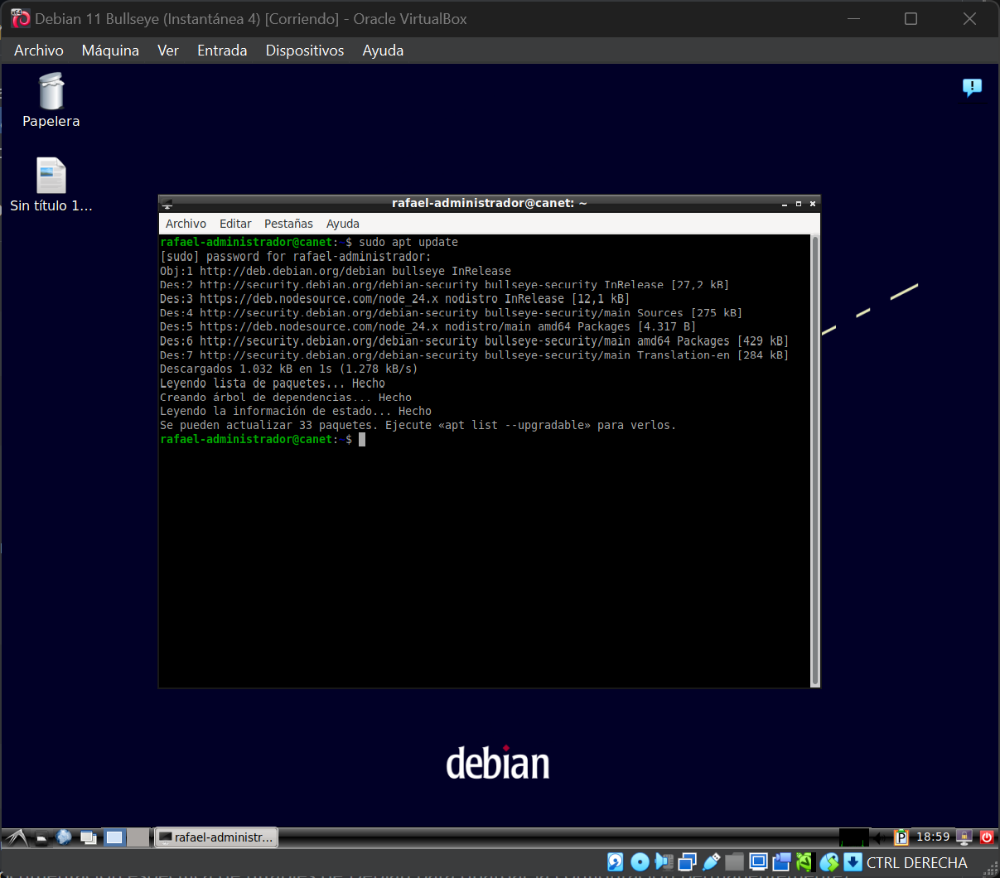

```bash
sudo apt upgrade → Actualizamos el sistema
```

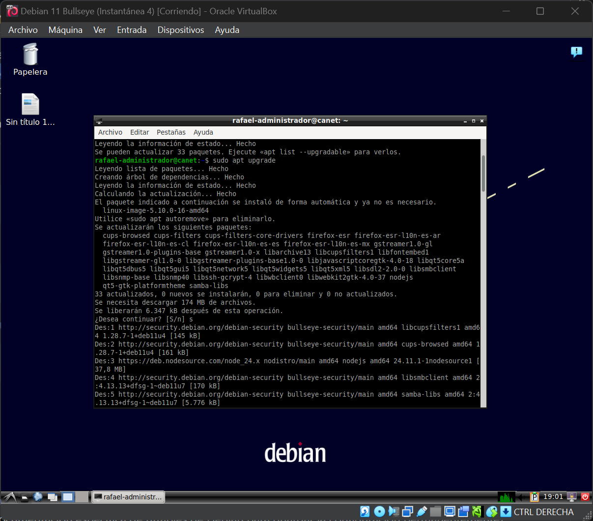

### 2. Instalamos vsftpd (Very Secure FTP Daemon) en Debian 11
 - Utilizamos el comando:
 ```bash
 sudo apt install vsftpd
 ```

 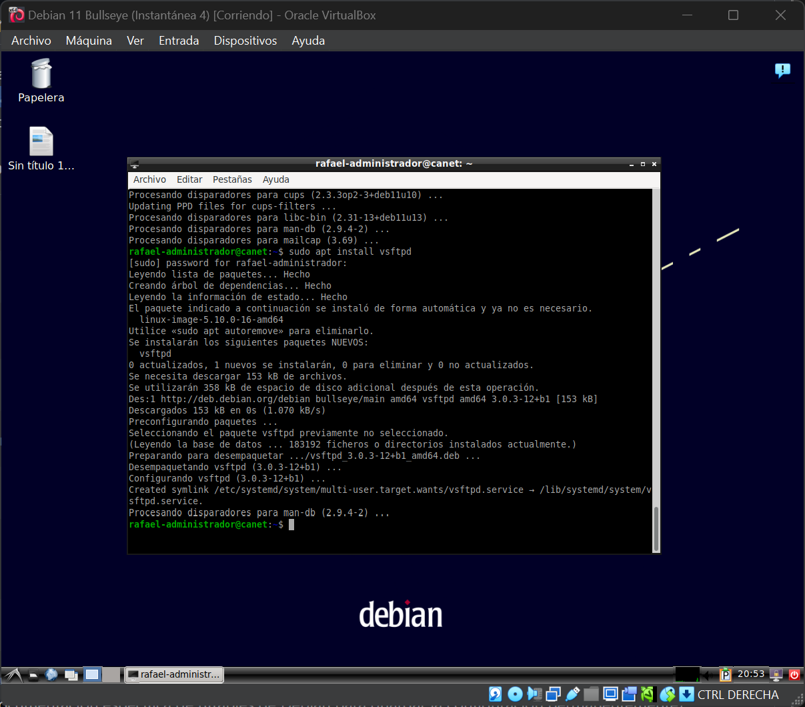

#### 2.1. Una vez instalado, el servicio se iniciará automáticamente. Verificamos el estado del servicio para ver que está funcionando correctamente. Usamos el siguiente comando: 
 ```bash
 sudo systemctl status vsftpd
 ```

 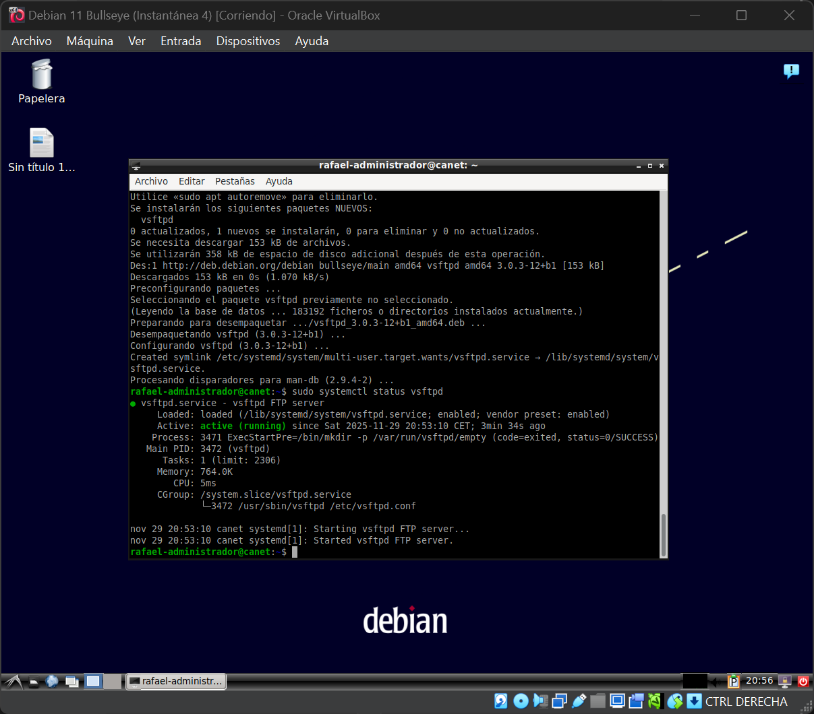

 - Está funcionando correctamente (indica: active (running)).

### 3. Configurar el Firewall (nftables) Debian 11 usa nftables por defecto.

 - Si necesitáramos configurar nuestro servidor Debian de forma remota, sería necesario ejecutar el siguiente comando:

 ```bash
 ssh -l rafael-administrador 192.168.1.128
 ```
 Este comando inicia una sesión SSH en nuestro servidor, permitiéndonos ejecutar comandos de forma remota.

#### 3.1. Primero debemos permitir el tráfico en el puerto FTP estándar (puerto 21):
 ```bash
 sudo nft add rule ip filter input tcp dport { 21 } ct state new accept
 ```
 
 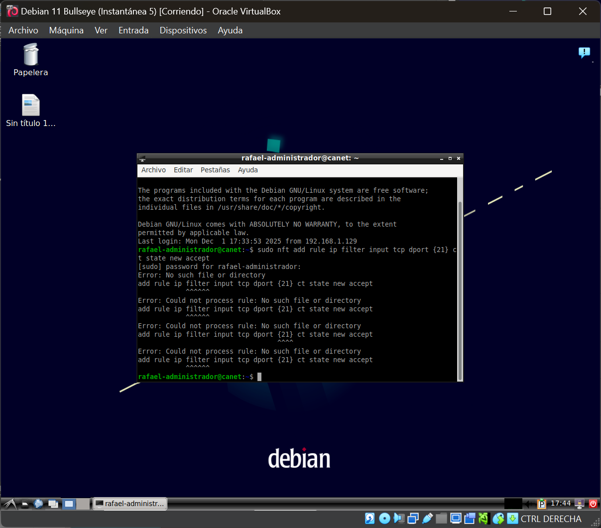


 - Se nos indica que no es posible procesar la regla. Esto se debe a que el directorio o archivo filter no existe. Debemos crear la tabla filter, que debería existir de manera predeterminada en nftables. Antes comprobamos si de verdad no existe con el comando:

 ```bash
 sudo nft list tables
 ```
 
 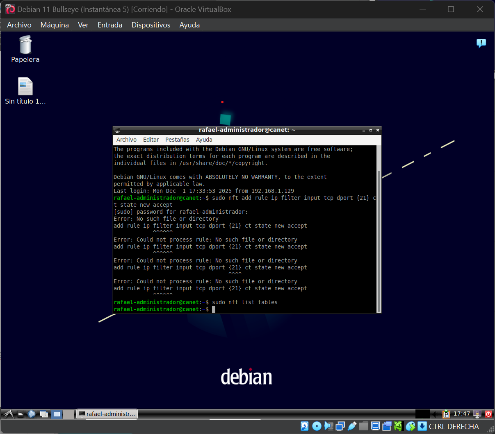

 - Como vemos, no muestra nada, lo que demuestra que no se ha creado la tabla filter de forma prederteminada. Si existiera debería mostrar algo parecido a esto:

 **table ip filter**

##### 3.1.1. Vamos a crear la tabla filter, la cadena input y luego agregar la regla para permitir el tráfico FTP en el puerto 21.

 - Creamos la tabla filter. Usamos el siguiente comando:

 ```bash
 sudo nft add table ip filter
 ```
 
 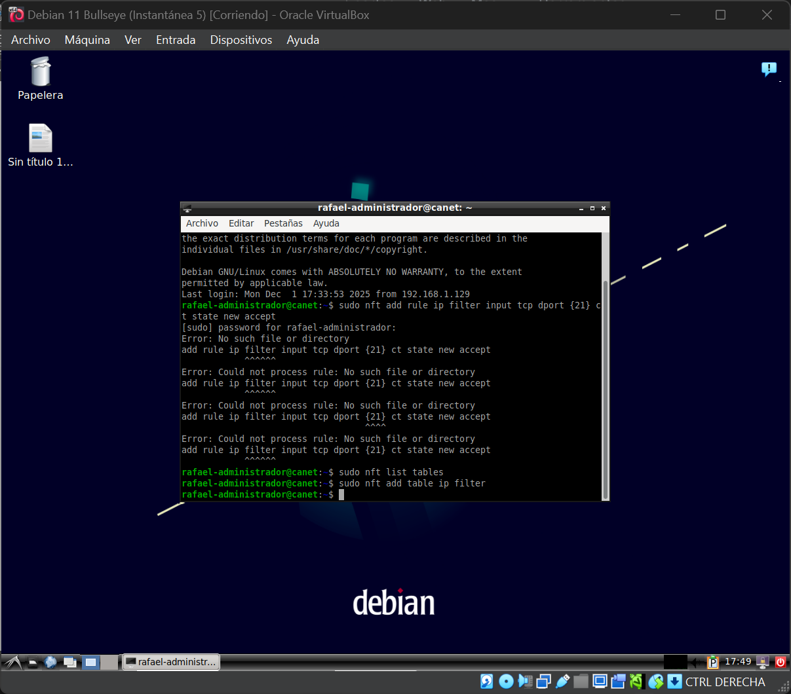

 - Creamos la cadena input dentro de la tabla filter. Usamos el siguiente comando:

 ```bash
 sudo nft add chain ip filter input { type filter hook input priority 0 \; }
 ```
 
 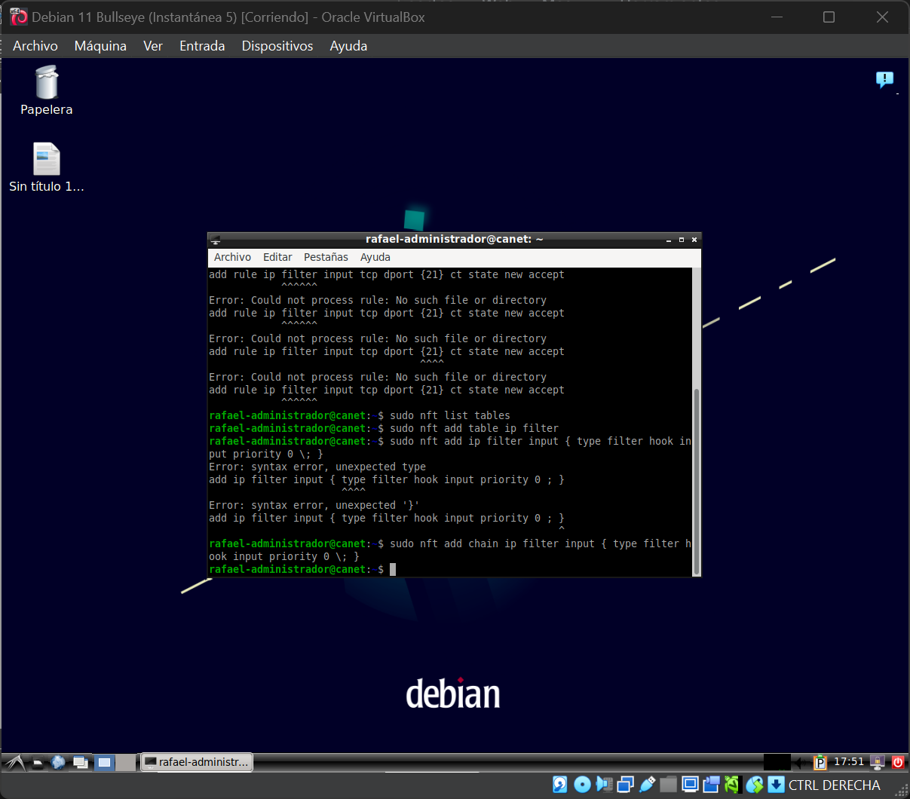
    
 - Agregar la regla para permitir el puerto 21 (FTP). Usamos el siguiente comando:

 ```bash
 sudo nft add rule ip filter input tcp dport {21} ct state new,established accept
 ```  
 - Añadimos a la regla “established”. Esto permite que el tráfico posterior, como la transferencia de archivos, sea aceptado. Garantizamos que las transferencias de archivos se puedan realizar correctamente después de establecer la conexión inicial al puerto 21.  Si no usamos “established”, las conexiones de respuesta (como la transferencia de archivos) serían bloqueadas, y aunque el usuario FTP puede autenticarse correctamente, no podrá transferir archivos.

 - Usar solo "new" hará que el servidor solo permita conexiones nuevas al puerto 21, pero no permitirá que esas conexiones nuevas continúen para transferir archivos (el tráfico posterior de una conexión FTP).
    
 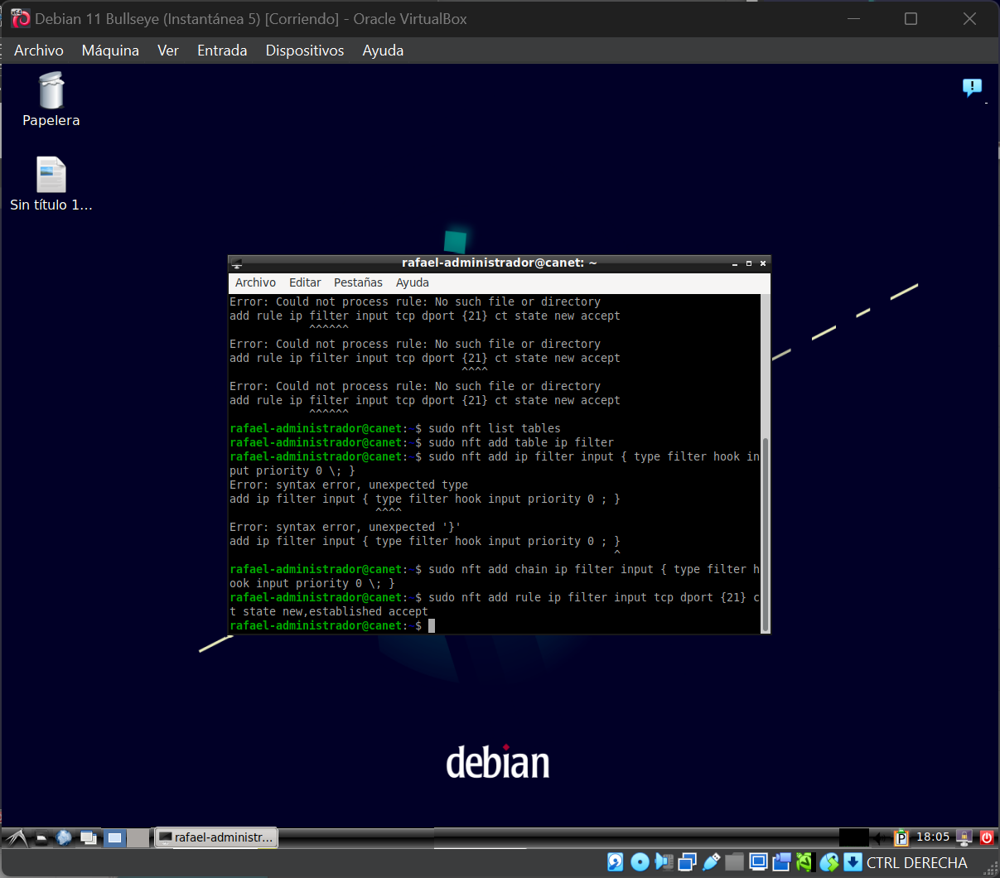

       
 - Para asegurarnos que la regla se ha guardado correctamente usamos el siguiente comando:

 ```bash
 sudo nft list ruleset
 ```
 
 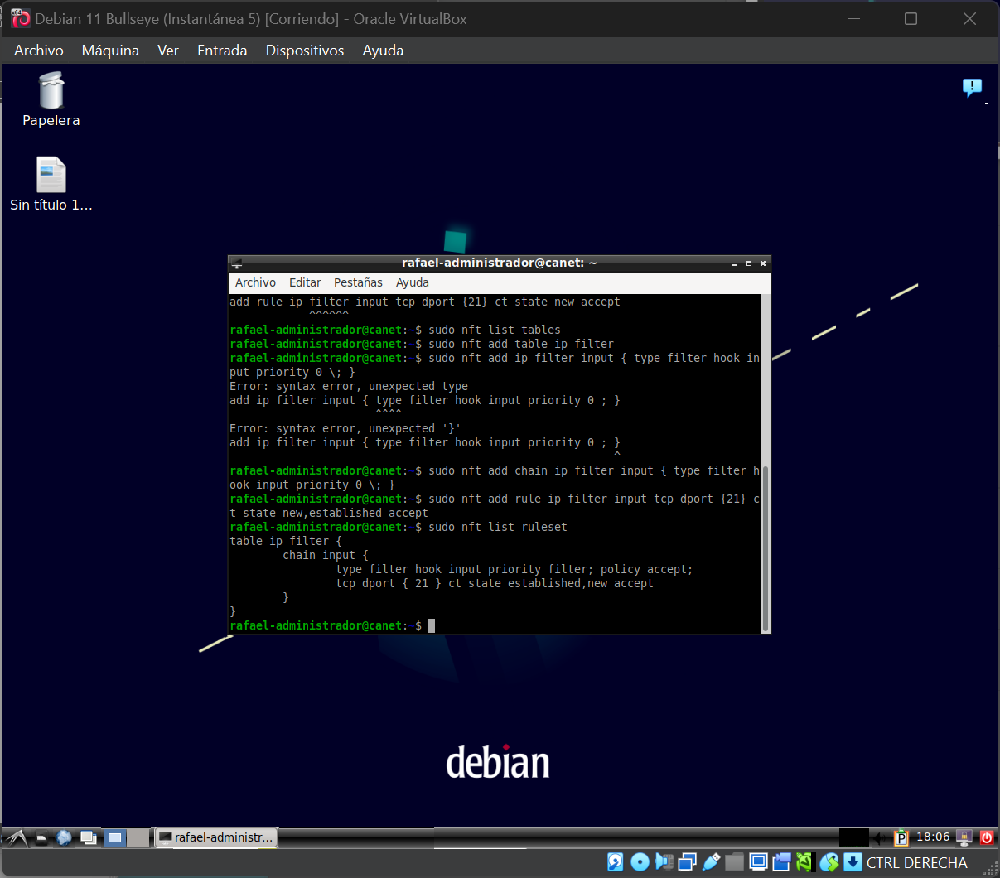


 - Podemos ver que se ha creado correctamente la regla.

#### 3.2. Para asegurarnos de que la configuración persista después de un reinicio, deberíamos guardar las reglas:
 ```bash
 sudo nft list ruleset > /etc/nftables.conf → se me deniega el permiso. 
 ```
 
 - Usamos el siguiente comando para evitar los problemas con los permisos:

 ```bash
 sudo sh -c 'nft list ruleset > /etc/nftables.conf'
 ```

 - La redirección de salida es manejada por el shell del usuario, no por el proceso de sudo. Por eso, aunque ejecutemos nft con sudo, el archivo no se puede escribir si no usamos la forma correcta de redirigir la salida.  Con esto guardamos las reglas actuales en el archivo de configuración de nftables, lo que garantiza que se carguen después de reiniciar y persistan.
 
 


##### 3.2.1. Comprobamos si se ha creado correctamente el archivo nftables.conf
 ```bash
 ls /etc/nftables.conf
 ```
 
 


 - Se ha creado el archivo.

##### 3.2.2. Verificamos los permisos del archivo /etc/nftables.conf:
 ```bash
 ls -l /etc/nftables.conf
 ```
 
 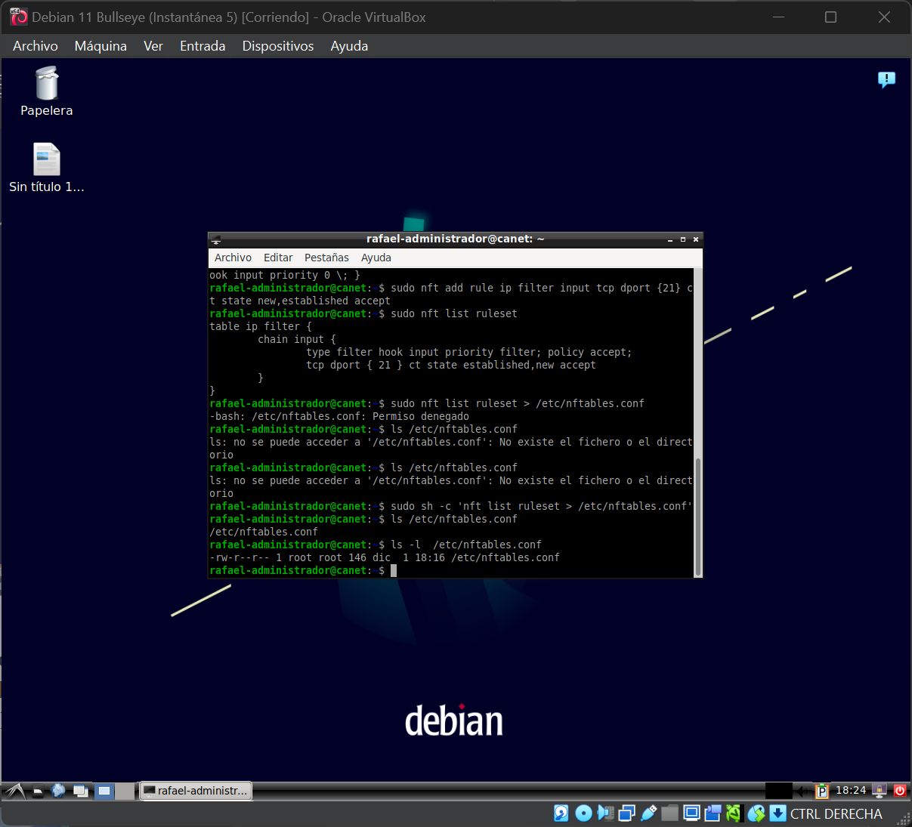

 - Tenemos los permisos necesarios. 

##### 3.2.3. Verificamos el contenido del archivo /etc/nftables.conf para asegurarnos de que las reglas se hayan guardado correctamente. Usamos el comando:
 ```bash
 cat /etc/nftables.conf
 ```
 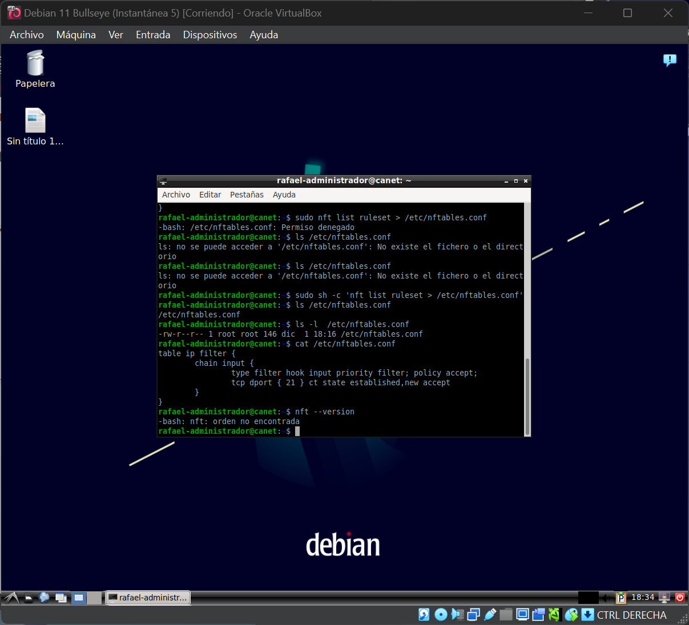


 - Si se ha guardado.

##### 3.2.4. Antes de proseguir, tenemos que estar seguros de tener nftables instalado, puede que no esté instalado de forma predeterminada (normalmente al instalar debian se instala nftables de forma predeterminada):
 ```bash
 nft --version
 ```
 
 

 - No está instalado o está en una ubicación no accesible. Es importante que instalemos nftables para que funcione correctamente luego con vsftpd.

 ```bash
 sudo apt update  → Actualizamos paquetes.
 sudo apt install nftables → Instalamos nftables
 ```
 
 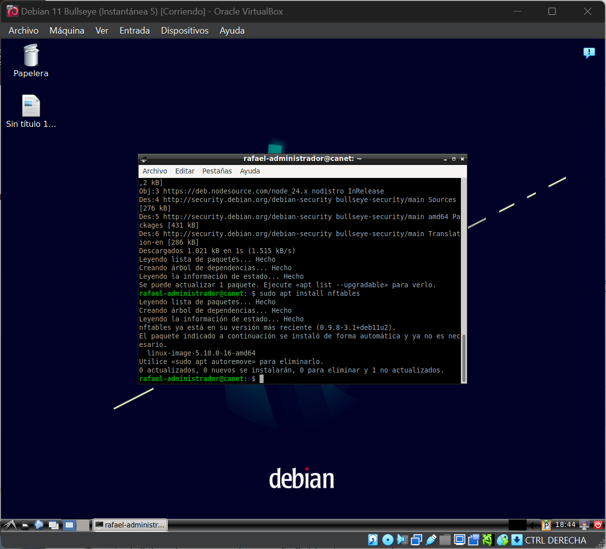


 - Todo correcto. Ya estaba instalado.

##### 3.2.5. Miramos si el servicio esta funcionando correctamente:
 ```bash
 sudo systemctl status nftables
 ```
 
 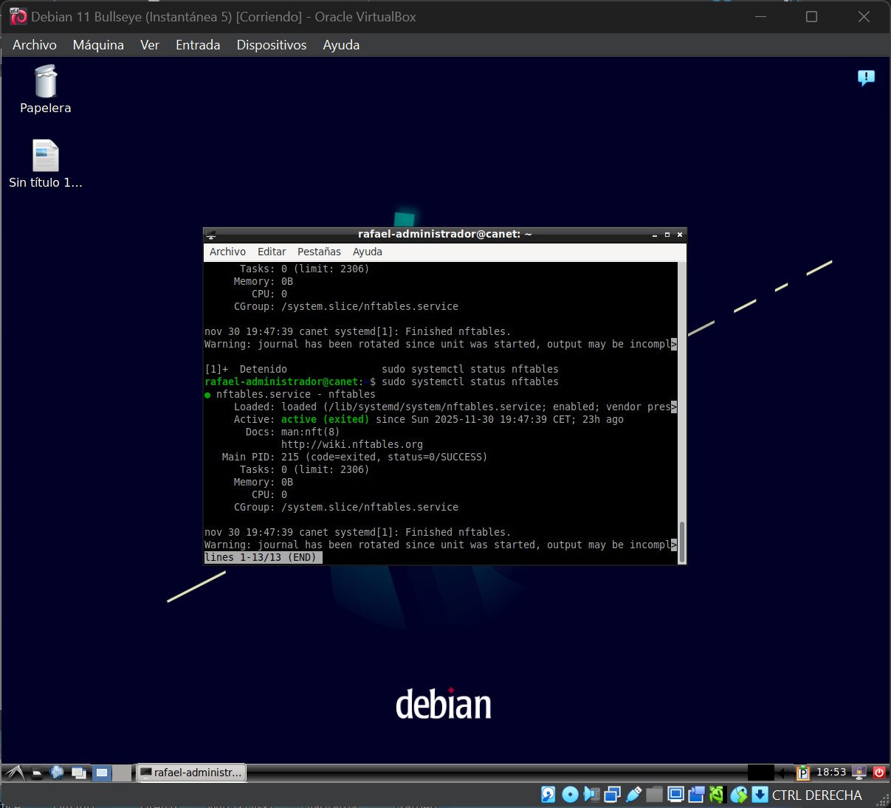

 - Funciona.

##### 3.2.6. Para cargar y aplicar las reglas guardadas desde /etc/nftables.conf debemos usar el siguiente comando:
 ```bash
 sudo nft -f /etc/nftables.conf
 ```
 
 

 - Para hacer que nftables cargue automáticamente las reglas al reiniciar el sistema, habilitamos el servicio con:

 ```bash 
 sudo systemctl enable nftables.service
 ```
 
 

 - Mediante el uso de este comando, nftables se inicia con el sistema y cargue las reglas guardadas en /etc/nftables.conf.

#### 3.3. Finalmente podemos verificar si el Puerto 21 está abierto. Usamos el siguiente comando:
 ```bash
 ss -tuln | grep 21
 ```

  - Este comando debe mostrar si el puerto 21 está abierto y escuchando en el sistema. 
 
 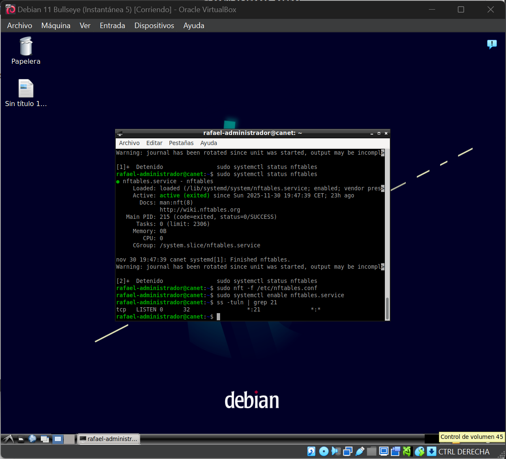

 - Sí se está escuchando.

### 4. Configurar vsftpd

- El archivo de configuración principal se encuentra en /etc/vsftpd.conf. Es una buena práctica hacer una copia de seguridad del archivo original antes de modificarlo. Usamos el siguiente comando:

```bash
sudo cp /etc/vsftpd.conf /etc/vsftpd.conf.bak
```
 
 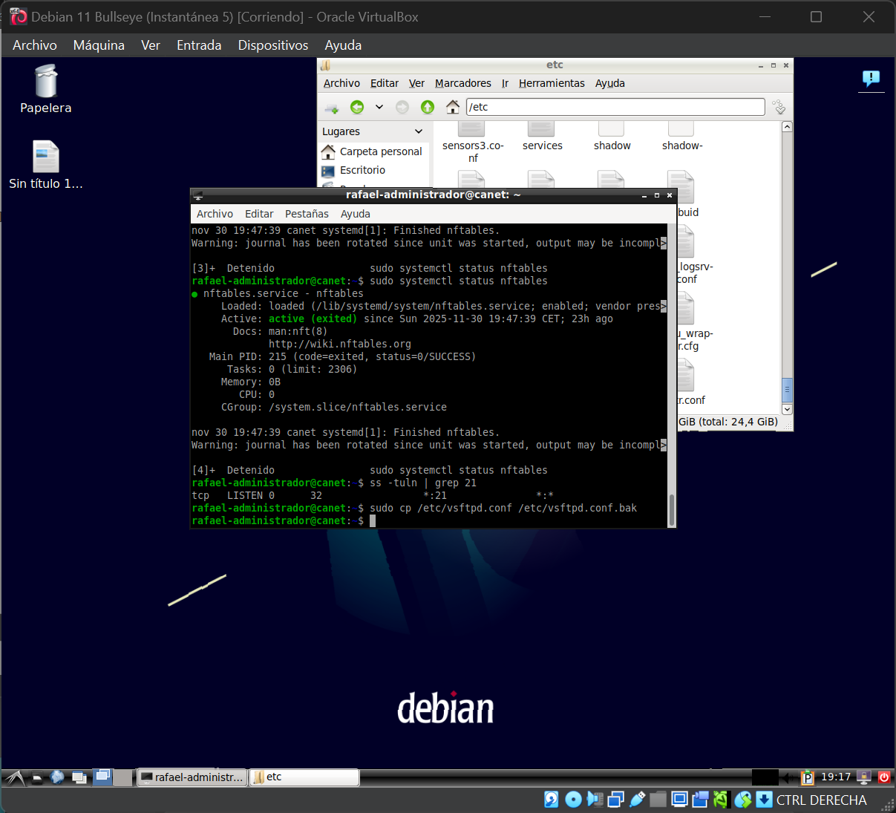

#### 4.1. Editamos el archivo /etc/vsftpd.conf con  editor de texto nano. Comando a usar:
 ```bash
 sudo nano /etc/vsftpd.conf
 ```

##### 4.1.1. Modificamos o añadimos las siguientes líneas para una configuración básica segura (tenemos que asegurarnos de que las opciones que queramos usar estén descomentadas):
 ```bash
 listen=NO      →Si usas systemd para manejar los sockets, lo cual es común en Debian 11 
 listen_ipv4=YES →En nuestro caso se nos indica IPv6, pero no es ningún problema, también escucha IPv4.
 anonymous_enable=NO →Deshabilita el acceso anónimo por seguridad
 local_enable=YES → Permite a los usuarios locales iniciar sesión
 write_enable=YES → Permite operaciones de escritura/carga
 ```
 
 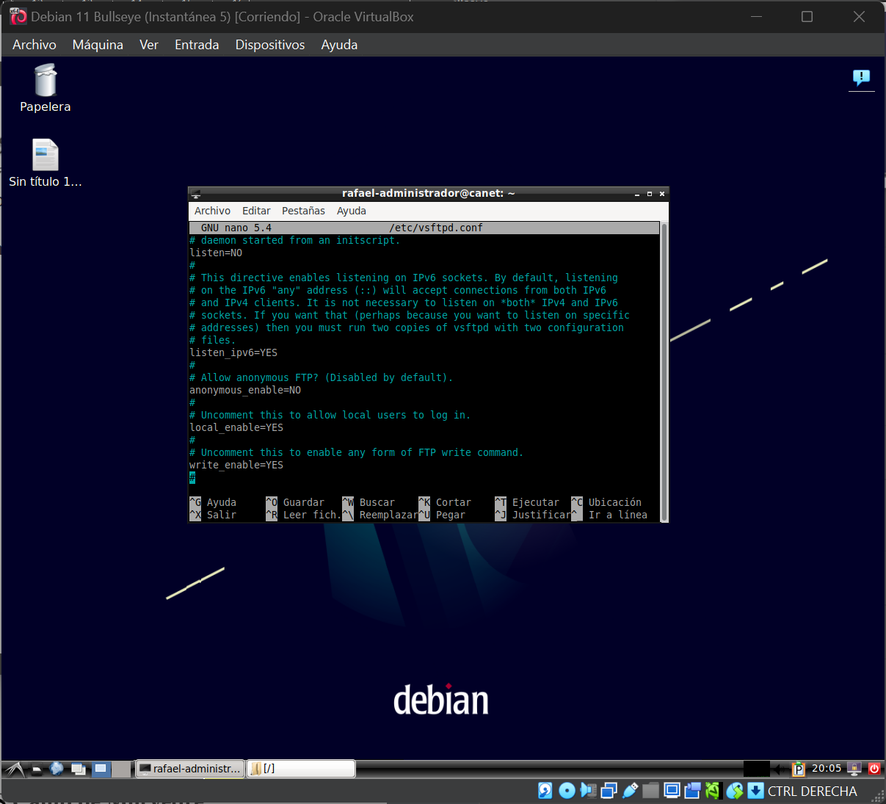


 ```bash
 chroot_local_user=YES → Encierra a los usuarios en sus directorios principales, impidiendo que accedan a otras partes del sistema
 ```
 
 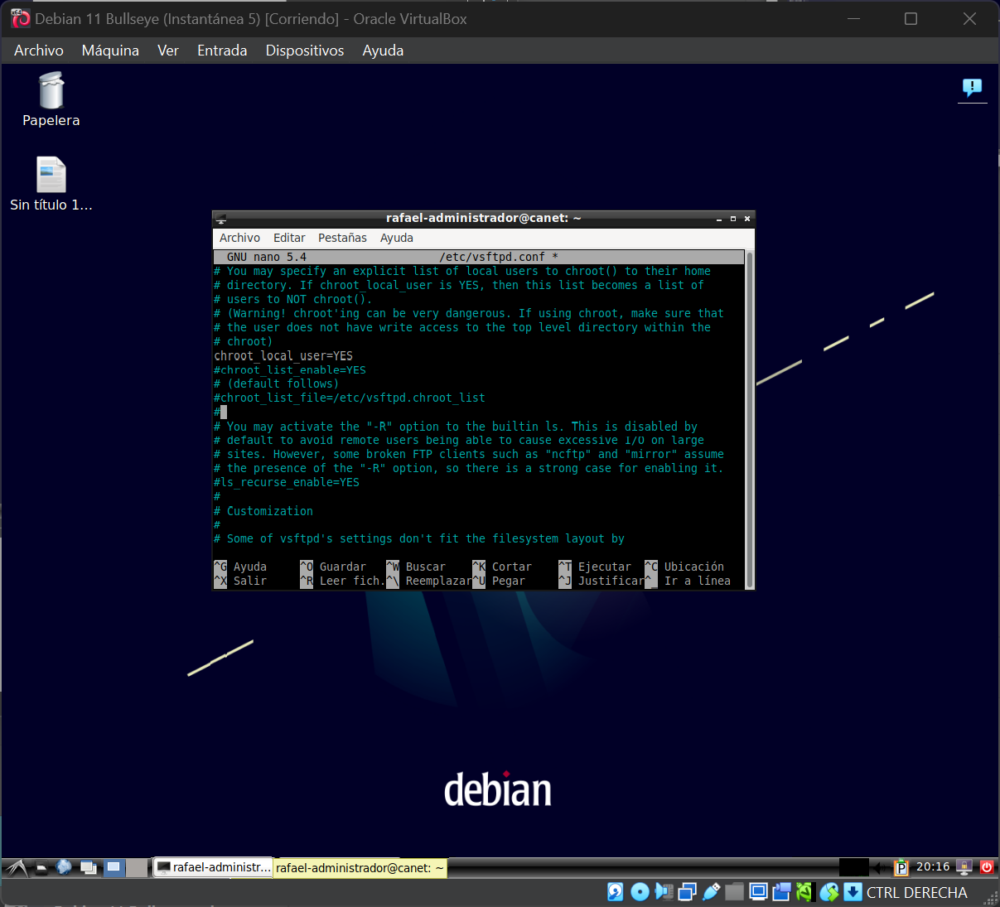

 - Presionamos Ctrl + X, decimos que Si queremos guardar y salimos presionando Enter.

### 5. Reiniciar el Servicio vsftpd 

 - Después de realizar los cambios en el archivo de configuración, reiniciamos el servicio para que surtan efecto:

 ```bash
 sudo systemctl restart vsftpd
 ```
 
 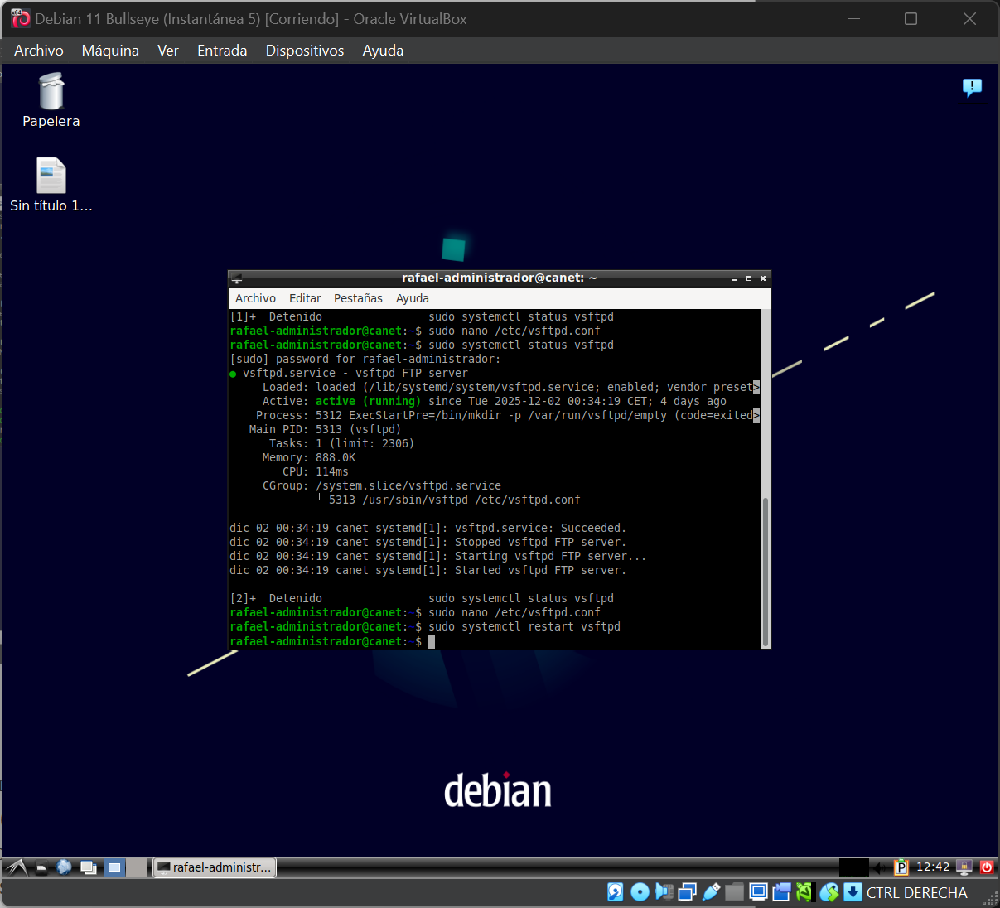

### 6. Crear un Usuario FTP (opcional)

 - Podemos usar un usuario del sistema existente o crear uno nuevo específicamente para FTP:

 ```bash
 sudo useradd -m ftp_user → sustituimos  ftp_user por el nombre de usuario deseado (rafaelHoyo).
 sudo passwd ftp_user → ftp_user indicamos el nombre de usuario elegido (1234RH-)
 ```
 
 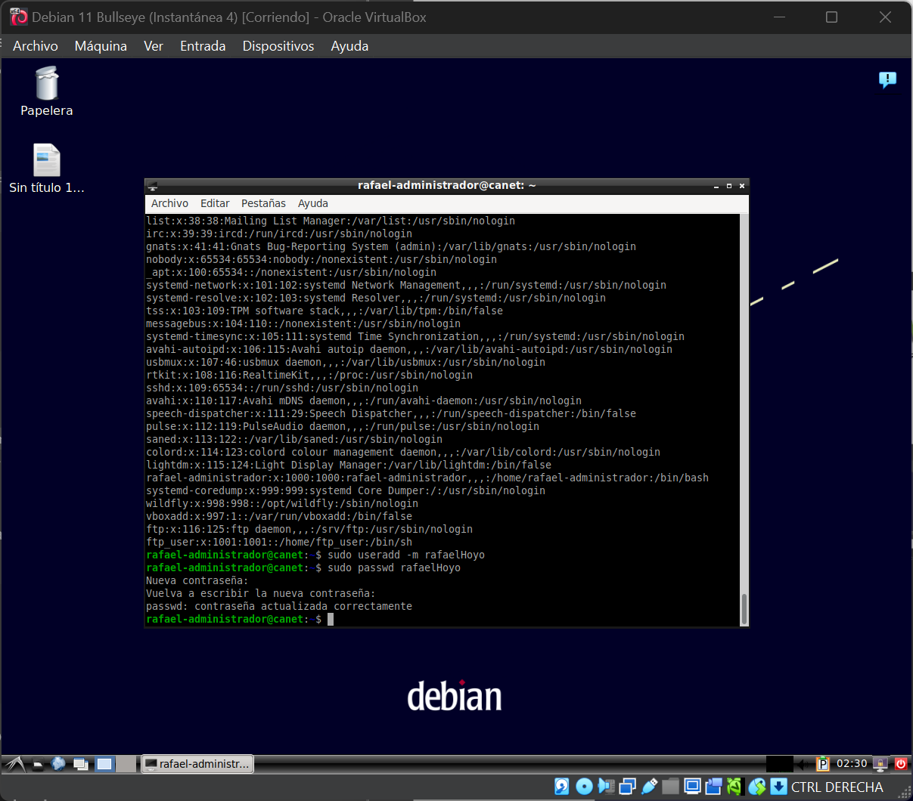

#### 6.1. Para ver los usuarios ftp existentes podemos usar el comando:
 ```bash
 cat /etc/passwd
 ```
 
 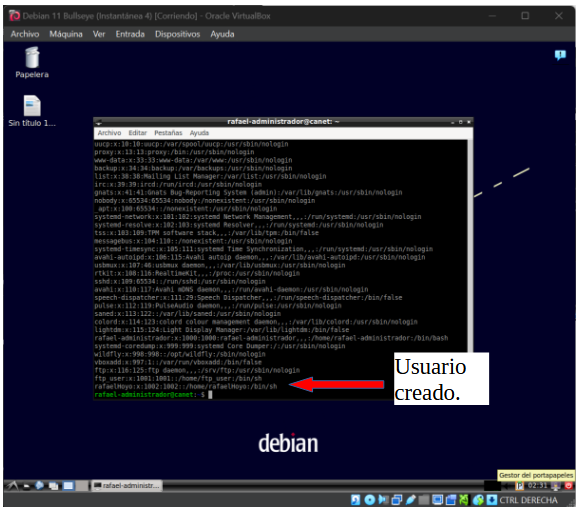

### 7. Acceder al Servidor FTP

- Podemos usar un cliente FTP como FileZilla o la línea de comandos en otro equipo para conectarnos al servidor utilizando la dirección IP del servidor, el nombre de usuario y la contraseña que hemos configurado. 

- **La IP del servidor es: 192.168.1.128**
- **Nombre usuario: rafaelHoyo**
- **Contraseña: 1234RH-**

#### 7.1. Nosotros usaremos FileZilla. Si no lo tuviéramos instalado, seguiríamos los siguientes pasos:

 - Descargar cliente FTP Filezilla desde https://filezilla-project.org/.
 
 
 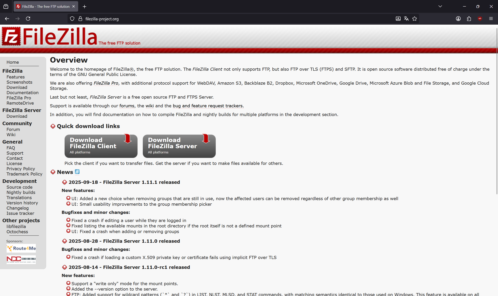


 - Una vez descargado, procedemos a instalarlo:


 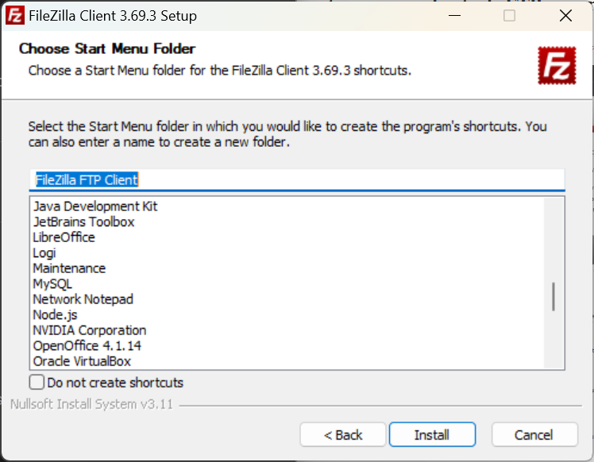

 - Ya tenemos preparado el cliente FTP:


 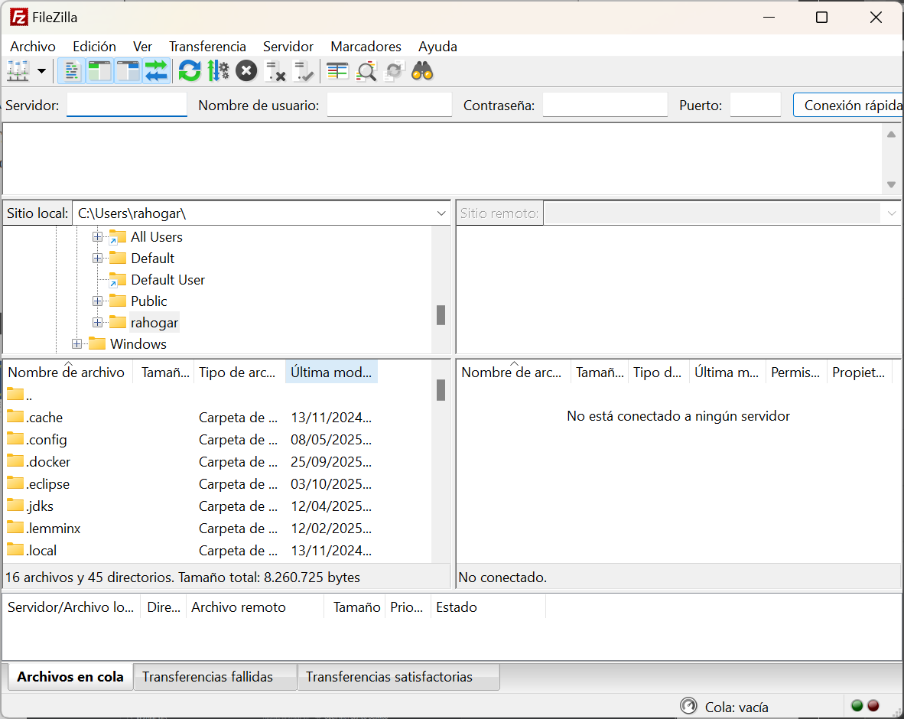


#### 7.2. Nos conectamos al servidor utilizando la dirección IP del servidor, el nombre de usuario y la contraseña que hemos configurado.

 - **Servidor: 192.168.1.128**
 - **Nombre de usuario: rafaelHoyo**
 - **Contraseña: 1234RH-**
 - **Puerto: 21**

 - Una vez hemos introducido los datos, presionamos en el botón que dice “Conexión rápida”.
 
 
 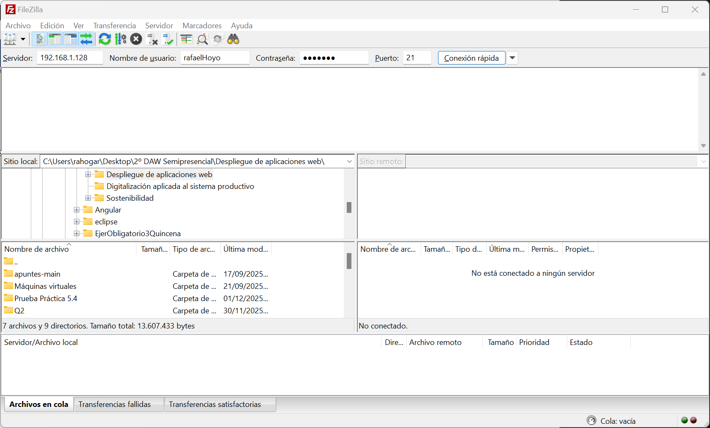


 - Nos sale el siguiente aviso. Presionamos en “Aceptar”.


 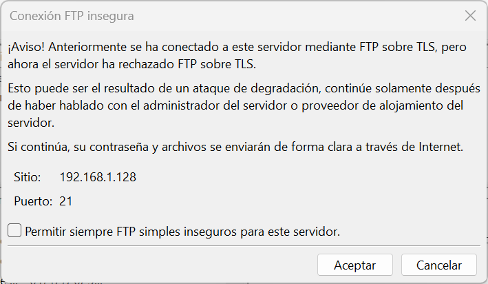


 - Nos da el siguiente fallo:


 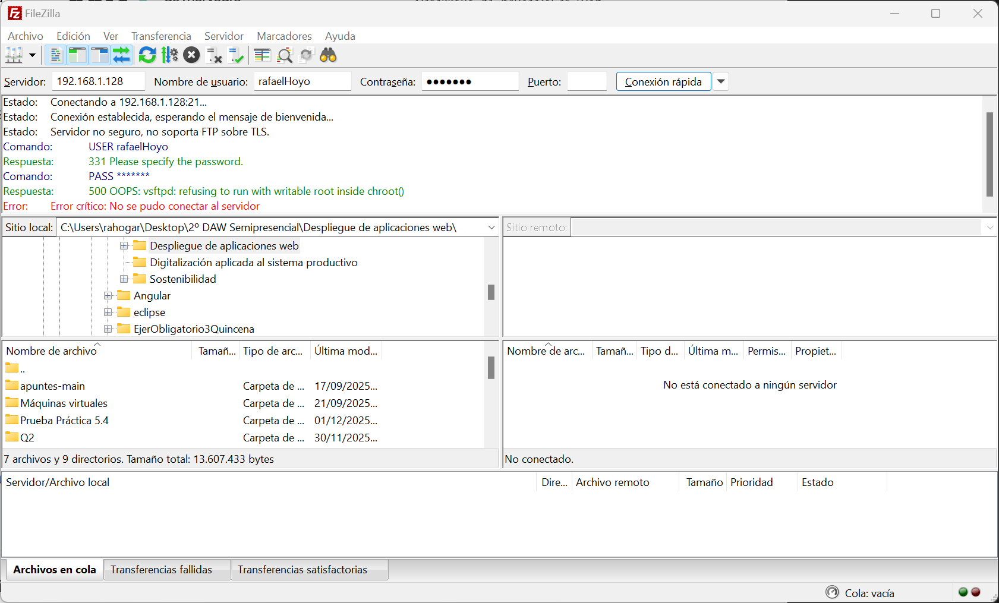


 ```bash
 Estado:	Conectando a 192.168.1.128:21...
 Estado:	Conexión establecida, esperando el mensaje de bienvenida...
 Estado:	Servidor no seguro, no soporta FTP sobre TLS.
 Comando:	USER rafaelHoyo
 Respuesta:	331 Please specify the password.
 Comando:	PASS *******
 Respuesta:	500 OOPS: vsftpd: refusing to run with writable root inside chroot()
 Error:	Error crítico: No se pudo conectar al servidor
 

 vsftpd: refusing to run with writable root inside chroot() → Nos indica que hay un error con la configuración de vsftpd, en concreto con chroot().
 ```
 - Esto significa que el usuario que intentamos usar tiene como directorio raíz (chroot) un directorio escribible, y vsftpd no permite que el directorio raíz del usuario sea escribible cuando  está activado chroot_local_user=YES. 
 - Cuando usamos vsftpd con usuarios enjaulados (chroot), la configuración típica es chroot_local_user=YES. Esto encierra al usuario en su /home/usuario (en mi caso: /home/rafaelHoyo). Pero si ese directorio es escribible por el usuario, vsftpd se niega a permitir el login, porque sería un riesgo de seguridad.

 - Para solucionar este problema se recomienda realizar lo siguiente:

 **Hacer el directorio raíz NO escribible y usar un subdirectorio para escritura.** 

 1. Convertimos /home/rafaelHoyo en No escribible. Usamos el siguiente comando:

 ```bash
 sudo chmod a-w /home/rafaelHoyo
 ```
 
 
 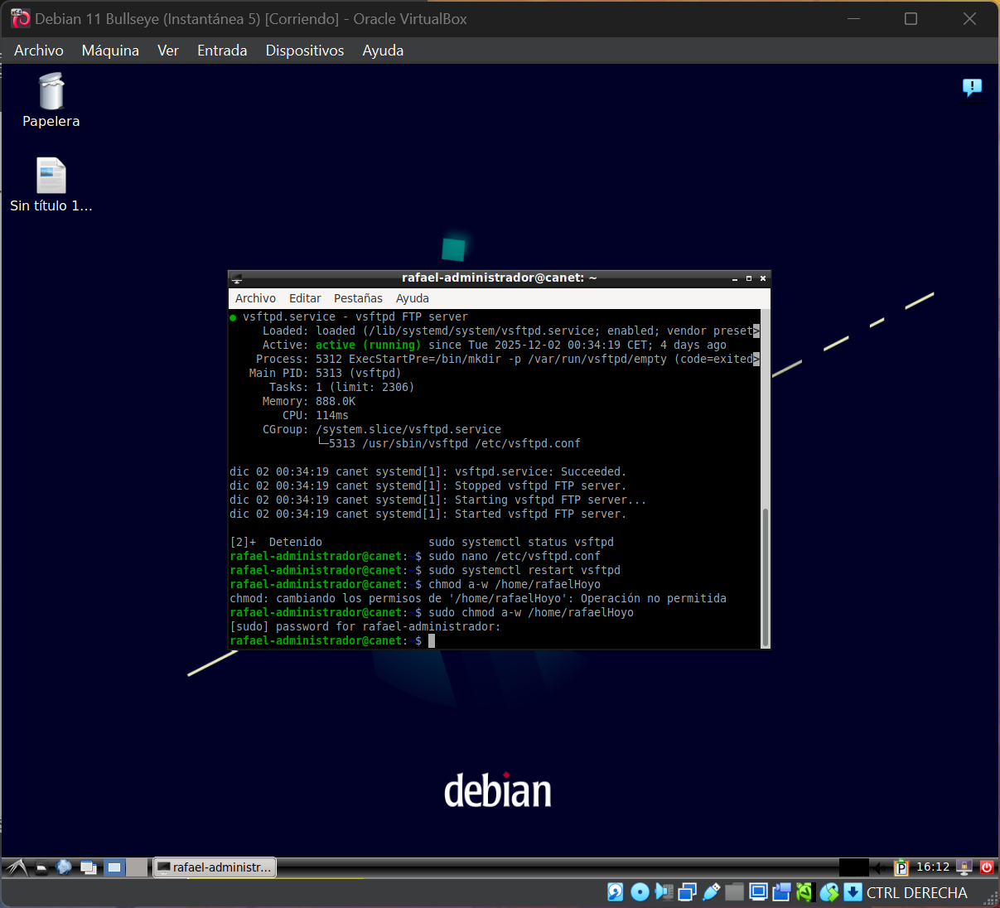


 2. Creamos dentro un directorio donde sí pueda escribir. Usamos el siguiente comando:
 ```bash
 sudo mkdir /home/rafaelHoyo/prácticaRA4.1 → Creamos el directorio
 sudo chown rafaelHoyo:rafaelHoyo /home/rafaelHoyo/prácticaRA4.1 → Asignamos la propiedad.
 ```
 
 
 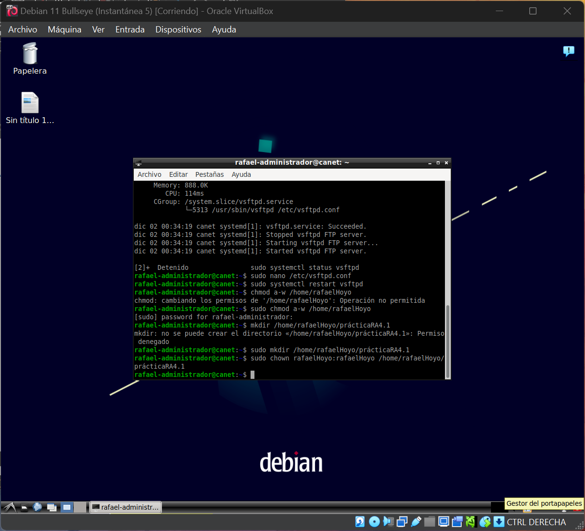


 3. Reiniciamos vsftpd. Usamos el siguiente comando:
 ```bash
 sudo systemctl restart vsftpd → Reiniciamos
 sudo systemctl status vsftpd → Comprobamos que funciona correctamente vsftpd
 ```
 
 
 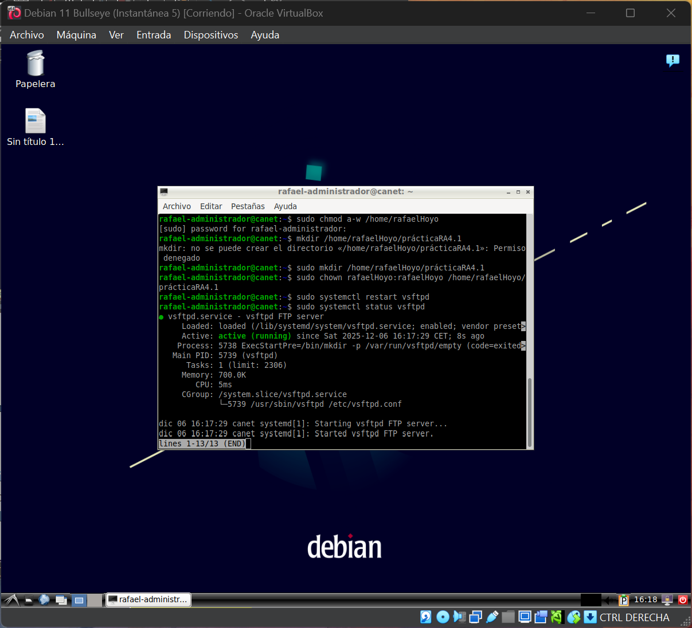

##### 7.2.1. Volvemos a probar la conexión con el servidor utilizando la dirección IP del servidor, el nombre de usuario y la contraseña que hemos configurado.

 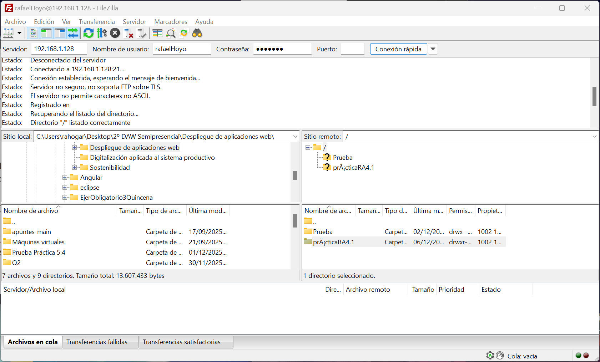

 - Ahora sí ha funcionado.

 **¡Aviso! La carpeta que se puede observar con el nombre "Prueba", se creó antes de aplicar en la configuración chroot_local_user=YES. El usuario rafaelHoyo, no podrá crear ninguna carpeta directamente en la raíz una vez activado dicho parámetro.**

### 8. Debido al uso de un acento, el nombre de la carpeta no es correcto, no se reconoce “´”.

 - Simplemente renombramos la carpeta con el comando:

 ```bash
 sudo mv /home/rafaelHoyo/prácticaRA4.1 /home/rafaelHoyo/practicaRA4.1
 ```

 - Asignamos la propiedad de la carpeta al usuario y reiniciamos vsftpd:

 ```bash
 sudo chown rafaelHoyo:rafaelHoyo /home/rafaelHoyo/practicaRA4.1
 sudo systemctl restart vsftpd → Reiniciamos
 ```
 
 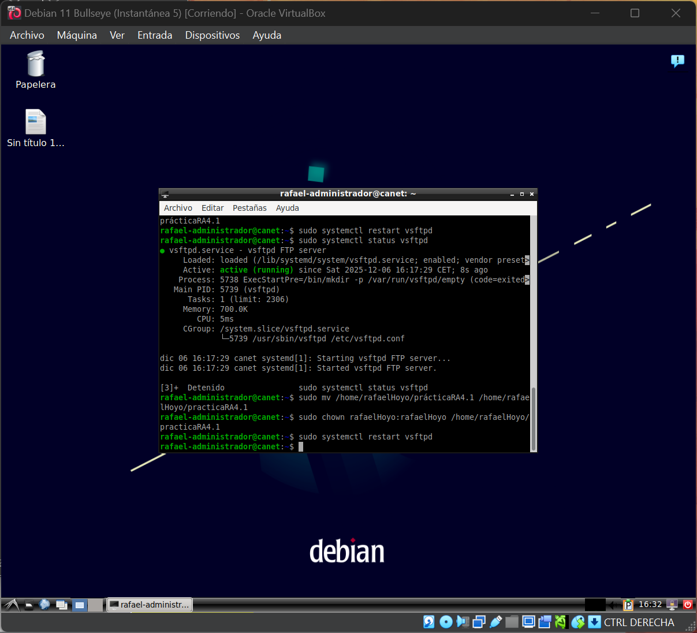


 - Veamos si ahora el nombre de la carpeta ahora es correcto en Filezilla:
 
 
 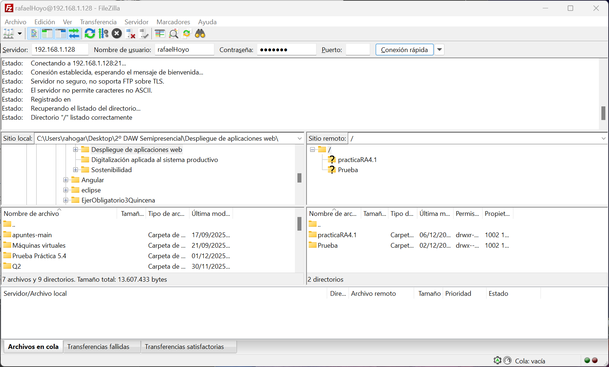


 - Ahora sí.

#### 8.1. También podemos comprobar si funciona correctamente el cortafuegos NFTABLES, donde indicamos anteriormente que sólo estará libre el puerto 21 (puerto prederteminado para usar FTP).

 - Cambiamos el puerto 21 por el puerto 20:

 
 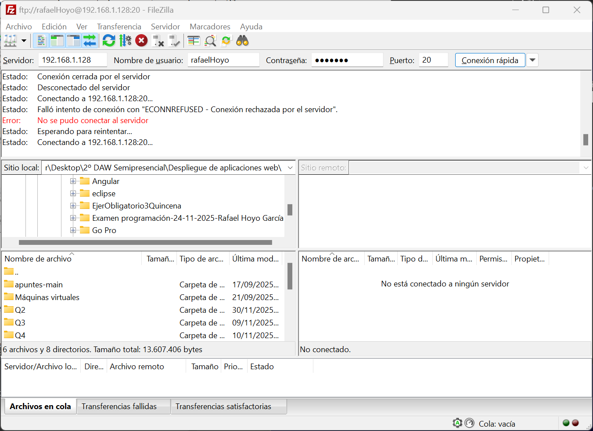
 
 
 - El cortafuegos funciona.

### 9. La conexión mediante FTP no es segura, ya que transmite datos, incluyendo contraseñas, en texto plano. Por ello, a continuación, cambiaremos la configuración de vsftpd para usar una comunicación más segura. Tendremos que usar SFTP (que corre sobre SSH) o FTPS (FTP sobre SSL/TLS). Nosotros aplicaremos FTPS sobre TLS. Esto habilitará el cifrado de la sesión FTP, haciendo que las credenciales y los archivos transferidos sean más seguros.

- Añadiremos las siguientes líneas en el archivo de configuración:

```bash
ssl_enable=YES →  Habilitará el cifrado de la sesión FTP, haciendo que las credenciales y los archivos transferidos sean más seguros. (Comentamos los archivos rsa_cert_file=/etc/ssl/certs/ssl-cert-snakeoil.pem y rsa_private_key_file=/etc/ssl/private/ssl-cert-snakeoil.key y usamos los que crearemos a continuación)
rsa_cert_file=/etc/ssl/certs/vsftpd.crt
rsa_private_key_file=/etc/ssl/private/vsftpd.key →  Parámetros para especificar los certificados SSL para un mayor nivel de seguridad

allow_anon_ssl=NO →  No permite que los usuarios anónimos usen SSL/TLS. 
force_local_data_ssl=YES →  Obliga a que los datos transferidos (subidas y descargas) por usuarios locales estén cifrados. 
force_local_logins_ssl=YES →  Obliga a que los usuarios locales inicien sesión mediante SSL/TLS. 
ssl_tlsv1=NO →  Impide que el servidor acepte conexiones usando TLS 1.0. TLS 1.0 es una versión antigua y considerada insegura, por lo que es buena práctica desactivarla. Nos aseguramos de que solo se acepten TLS 1.2 y 1.3, versiones modernas y seguras. 
ssl_sslv2=NO →  Desactiva SSL versión 2. SSLv2 es antiguo y muy inseguro, así que se desactiva. 
ssl_sslv3=NO →  SSLv3 también es inseguro y susceptible a ataques (como POODLE). 
require_ssl_reuse=NO →  Indica que no se requiere la reutilización de la sesión SSL entre comandos de FTP. Esto es útil para compatibilidad con algunos clientes FTP que no soportan la reutilización de sesión. 
ssl_ciphers=HIGH →  Especifica qué algoritmos de cifrado usar para TLS. 
```

- Pero antes de modificar el archivo de configuración debemos crear los certificados SSL. Los generaremos por OpenSSL.

#### 9.1. Generar certificados por OpenSSL:
 ```bash
 sudo openssl req -x509 -nodes -days 365 -newkey rsa:2048 -out /etc/ssl/certs/vsftpd.crt -keyout /etc/ssl/private/vsftpd.key
 ```
 
 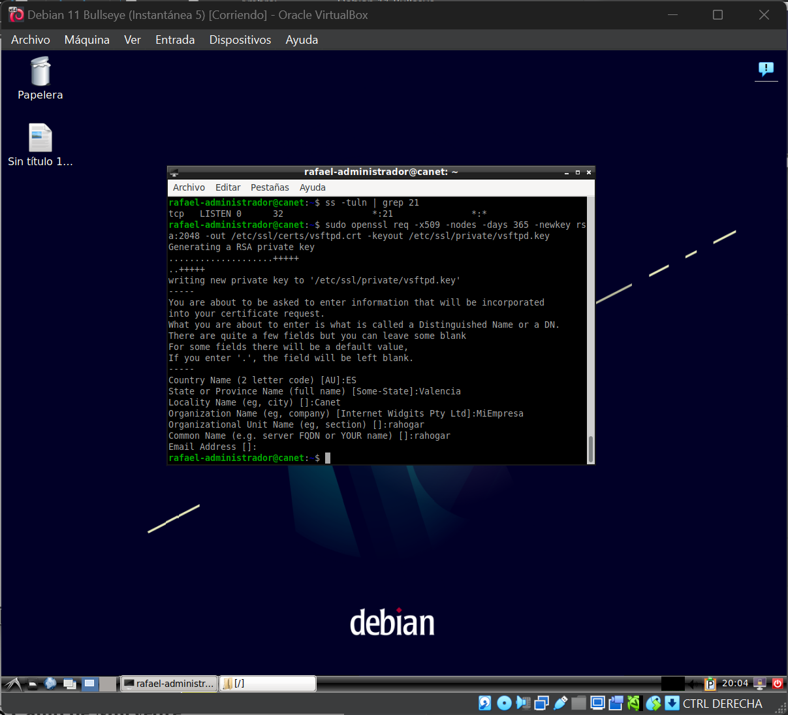

 - Rellenamos los campos que nos van pidiendo.

#### 9.2. Una vez generados los certificados, procederemos a cambiar la configuración del vsftpd. Modificamos el archivo  /etc/vsftp.conf usando el editor nano:
 ```bash
 sudo nano /etc/vsftpd.conf
 ```

 - Anteriormente cambiamos el archivo para tener la siguiente configuración:

 ```bash
 listen=NO (si usas systemd para manejar los sockets, lo cual es común en Debian 11)
 listen_ipv6=YES (Dejamos ipv6 indicado por defecto ya que también cubre ipv4.)  
 anonymous_enable=NO (deshabilita el acceso anónimo por seguridad)
 local_enable=YES (permite a los usuarios locales iniciar sesión)
 write_enable=YES (permite operaciones de escritura/carga)
 chroot_local_user=YES (encierra a los usuarios en sus directorios principales, impidiendo que accedan a otras partes del sistema)
 ```

 - Ahora añadimos lo siguiente:

 ```bash
 ssl_enable=YES
 rsa_cert_file=/etc/ssl/certs/vsftpd.crt
 rsa_private_key_file=/etc/ssl/private/vsftpd.key
 allow_anon_ssl=NO
 force_local_data_ssl=YES
 force_local_logins_ssl=YES
 ssl_tlsv1=NO
 ssl_sslv2=NO
 ssl_sslv3=NO
 require_ssl_reuse=NO
 ssl_ciphers=HIGH
 ```
 
 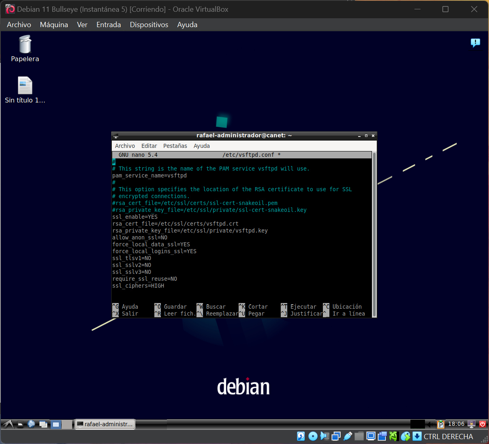


 - Presionamos Ctlr + X, decimos que Si queremos guardar y salimos presionando Enter.

#### 9.3. Una vez realizados los cambios necesarios en el archivo de configuración, reiniciamos el servicio  vsftpd para que surtan efecto: 
 ```bash
 sudo systemctl restart vsftpd
 ```
 
 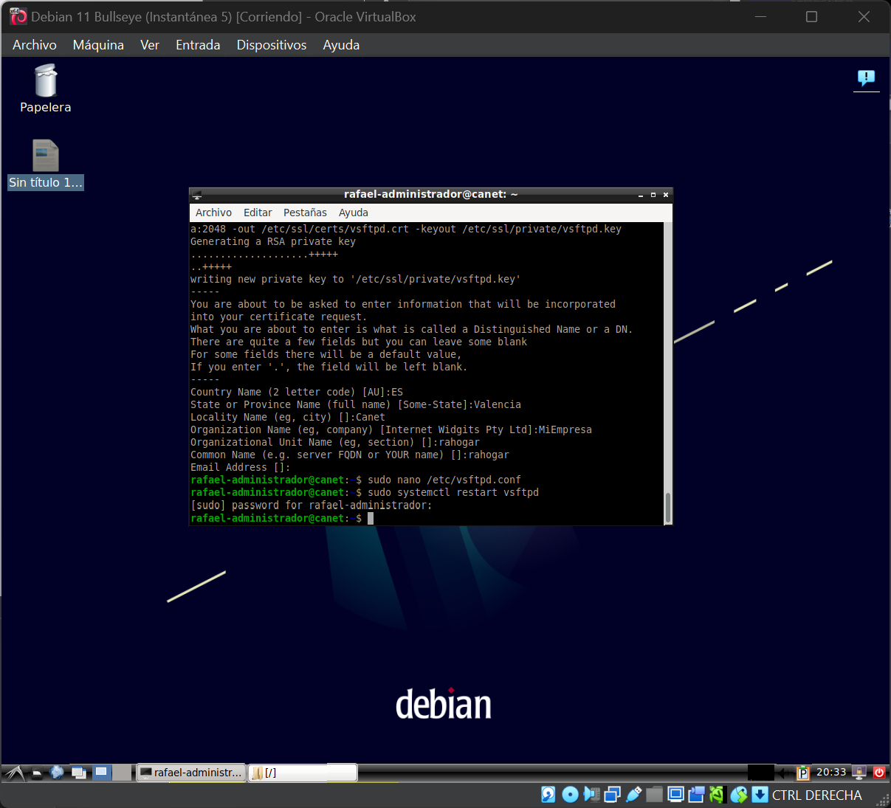

### 10. Ahora procederemos a realizar la conexión desde el cliente a nuestro servidor Debian usando Filezilla, esta vez con FTPS.

#### 10.1. Configuramos la conexión para poder conectarnos a nuestro servidor FTP en Debian 
 1. Vamos a Archivo → Gestor de sitios
 
 
 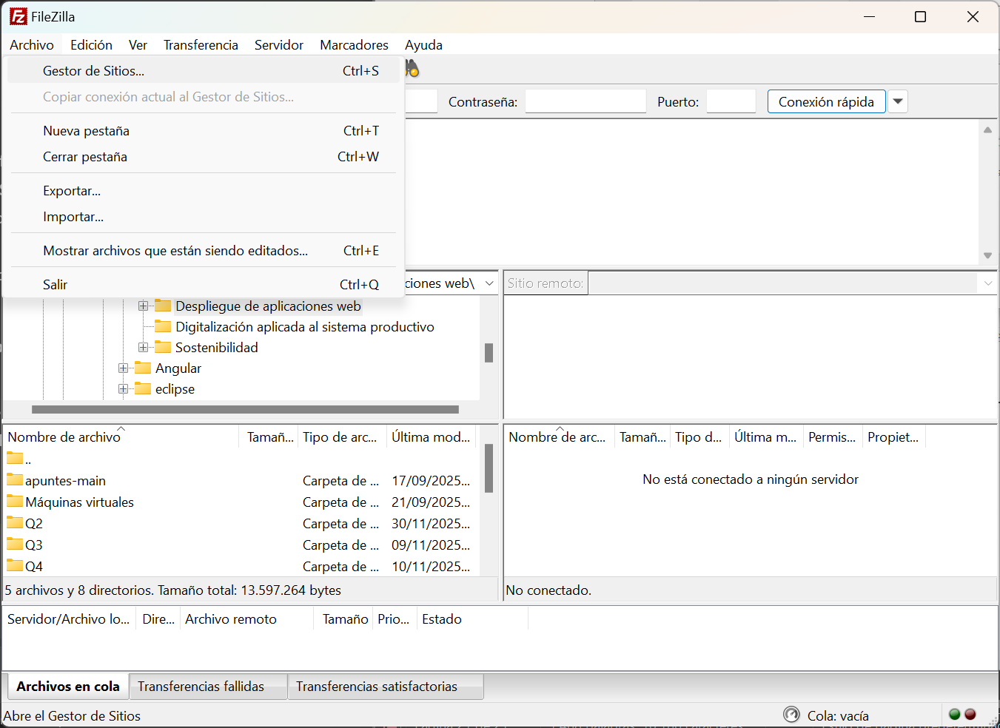


 2. Hacemos clic en Nuevo Sitio 
 
 
 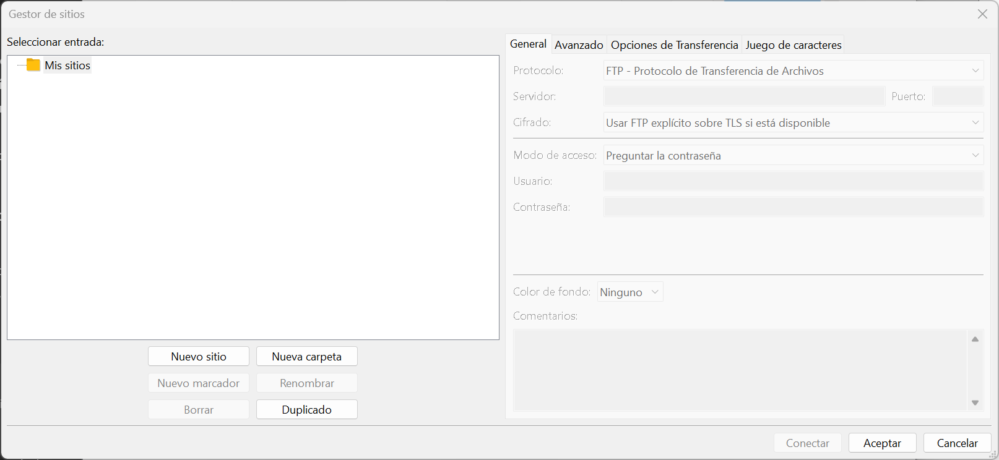


 3. Configuramos la conexión:
 - En Protocolo, seleccionamos FTP - Protocolo de Transferencia de Archivos. 
 - En Cifrado, selecciona Usar FTP explícito sobre TLS si está disponible. 
 - Introduce la dirección IP del servidor (192.168.1.128), el nombre de usuario FTP (rafaelHoyo) y la contraseña (1234RH-). 
 - Puerto: 21  
 
 
 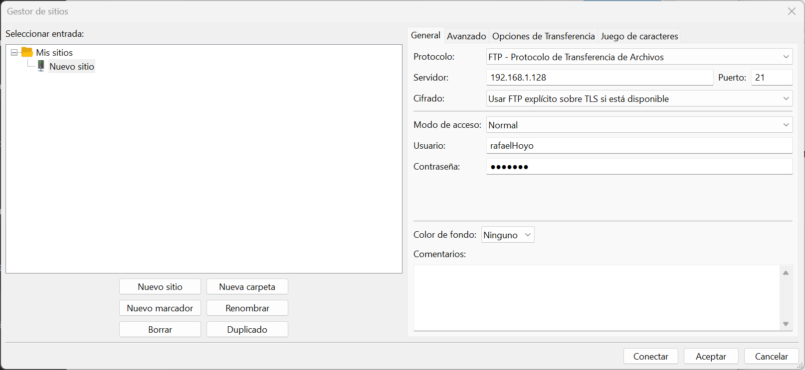


 4. Presionamos en conectar
 - Nos preguntará por la contraseña.
 
 
 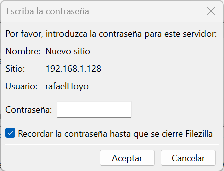


 Una vez ingresada la contraseña, nos sale la siguiente ventana:
 
 
 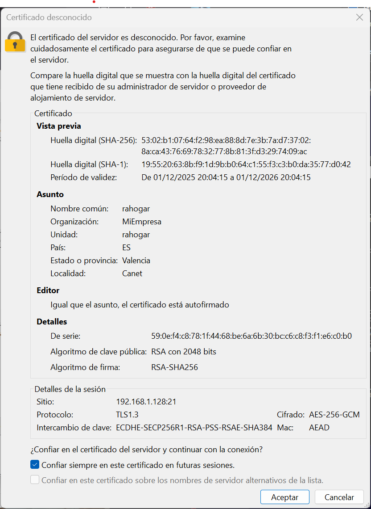


 - Aceptamos y marcamos”Confiar siempre en este certificado en futuras sesiones”.
 
 5. Conexión ha sido establecida.
 
 
 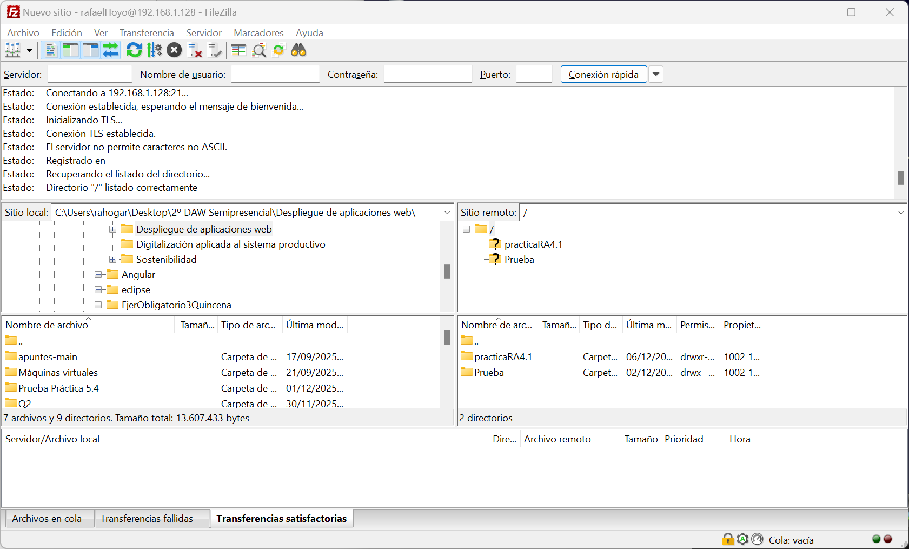
 
 
 - Todo correcto.

### 11. El modo de transferencia usado en Filezilla es el Pasivo (se abre la conexión de datos al servidor). Nosotros no hemos establecido un rango de puertos pasivos en nuestro servidor, pero funciona igualmente porque el servidor elige automáticamente puertos aleatorios (usualmente >1024).  Se permiten temporalmente esas conexiones porque son “efímeras” y el firewall predeterminado las permite.  

- Pero se recomienda definir los puertos pasivos en un rango establecido para tener un mayor control sobre los puertos. Las razones son las siguientes:
    1. Seguridad 
        ◦ Si no defines el rango, vsftpd usará puertos aleatorios del sistema (>1024).
        ◦ Esto puede exponer puertos inesperados y dificultar el control con firewalls.
    2. Compatibilidad con NAT/routers/firewalls 
        ◦ Muchos routers bloquean puertos aleatorios por defecto.
        ◦ Definir un rango conocido permite abrir solo esos puertos y garantizar que las transferencias de archivos funcionen.
    3. Facilita la configuración del firewall 
        ◦ Solo necesitas abrir un rango específico (por ejemplo 40000-50000) en nftables o iptables.
        ◦ Sin rango definido, tendrías que abrir todos los puertos efímeros, lo que es inseguro.
    4. Estabilidad en conexiones remotas 
        ◦ Clientes FTP (como FileZilla) siempre podrán conectarse a los puertos pasivos definidos.
        ◦ Evita errores intermitentes de transferencia de archivos.

#### 11.1. Abrimos puertos pasivos en NFTABLES 

 - Usamos el siguiente comando (usaremos el rango de puertos de 40000-50000 como ejemplo)

 ```bash
 sudo nft add rule ip filter input tcp dport { 40000-50000 } ct state new,established accept
 ```
 y guardamos:

 ```bash 
 sudo sh -c 'nft list ruleset > /etc/nftables.conf'
 ```
 
 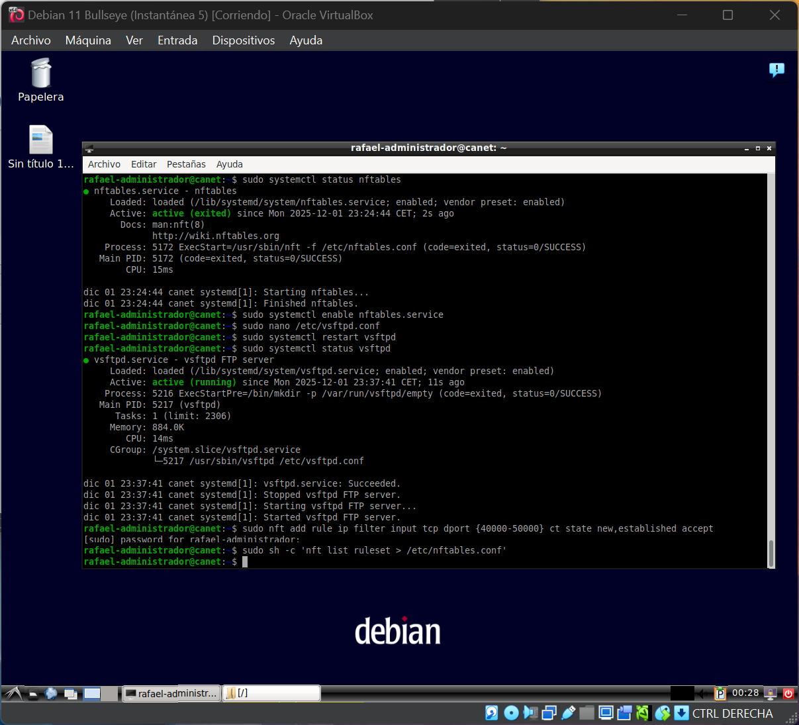


#### 11.2. Añadiremos los puertos pasivos configurados al archivo de configuración de vsftpd:
 ```bash
 pasv_min_port=40000
 pasv_max_port=50000
 ```

 - Usaremos el siguiente comando para modificarlo:

 ```bash
 sudo nano /etc/vsftpd.conf
 ```
 
 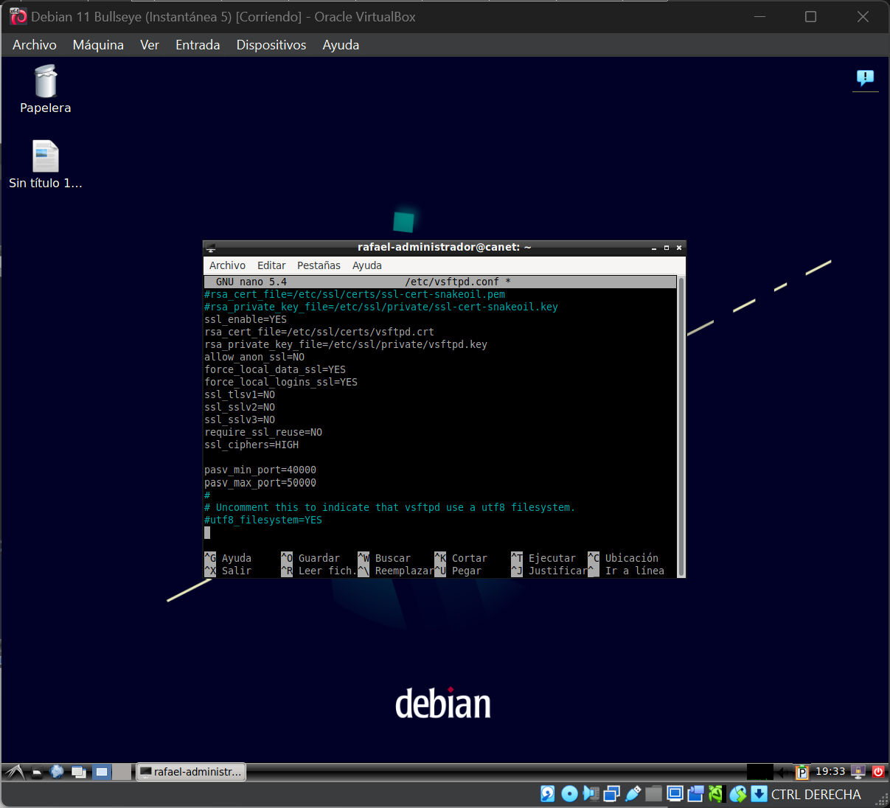


 - Presionando Ctrl + X, le decimos Si a guardar y salimos del editor con Enter.

#### 11.3. Reiniciamos el servicio vsftpd:
 ```bash
 sudo systemctl restart vsftpd
 ```
 
 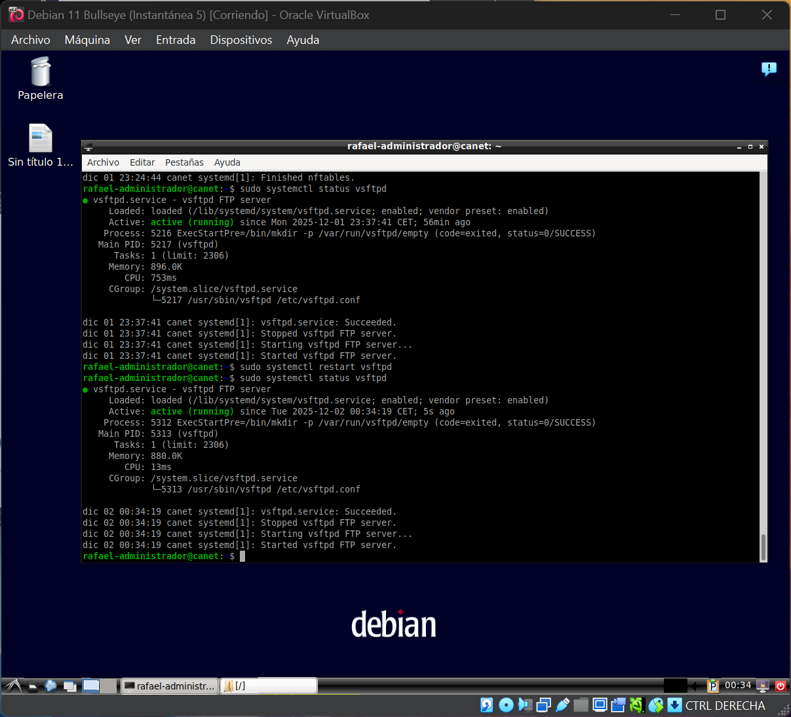

### 12. Por último probamos que el envío de archivos entre el cliente y el servidor funcione correctamente.

#### 12.1. Primero probamos creando una carpeta desde el cliente Filezilla para ver si funciona correctamente la conexión:

 1. Creación desde Filezilla de una carpeta en el servidor (Prueba):

 - Como tenemos habilitado chroot_local_user=YES en nuestra configuración de vsftpd.conf, el usuario FTP estará restringido a su directorio home y no podrá crear directorios fuera de ese entorno.

 - Si intentáramos crear la carpeta fuera del directorio home del usuario (por ejemplo, en / o en un directorio de sistema), esto fallará. Nos dará un error como este: Respuesta:	550 Create directory operation failed.

 - Nos tenemos que asegurar de que el directorio de destino esté dentro del directorio home del usuario o un subdirectorio permitido. Nosotros podremos solo crear las carpetas y enviar los archivos al subdirectorio /practicaRA4.1.

 
 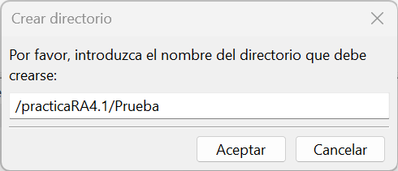

 
 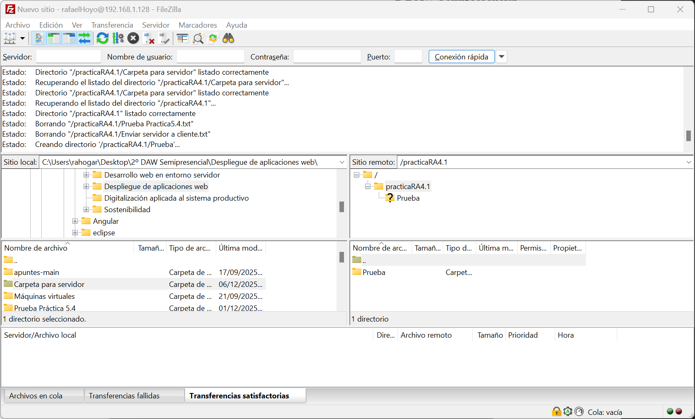
 

 - Todo correcto.

#### 12.2. Copiamos un archivo de texto desde el cliente al servidor dentro de la carpeta practicaRA4.1:
 
 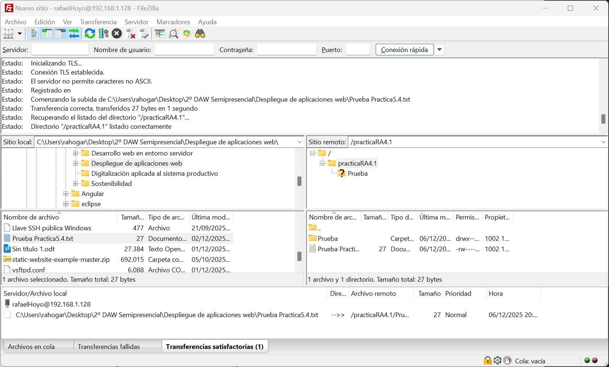

 - También funciona desde el servidor al cliente:

 1. Creamos el archivo de texto en el servidor.
 
 
 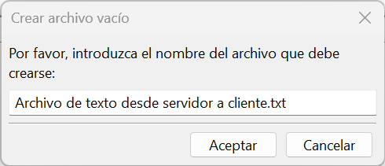


 2. Enviamos el archivo al cliente.
 
 
 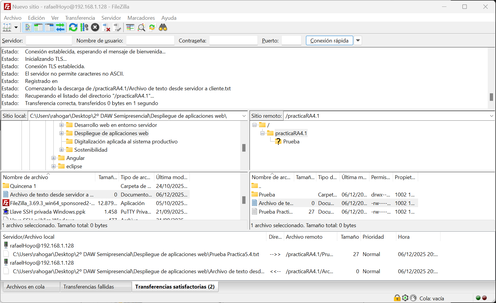


#### 12.3. Finalmente probamos a enviar una carpeta desde el cliente al servidor
 
 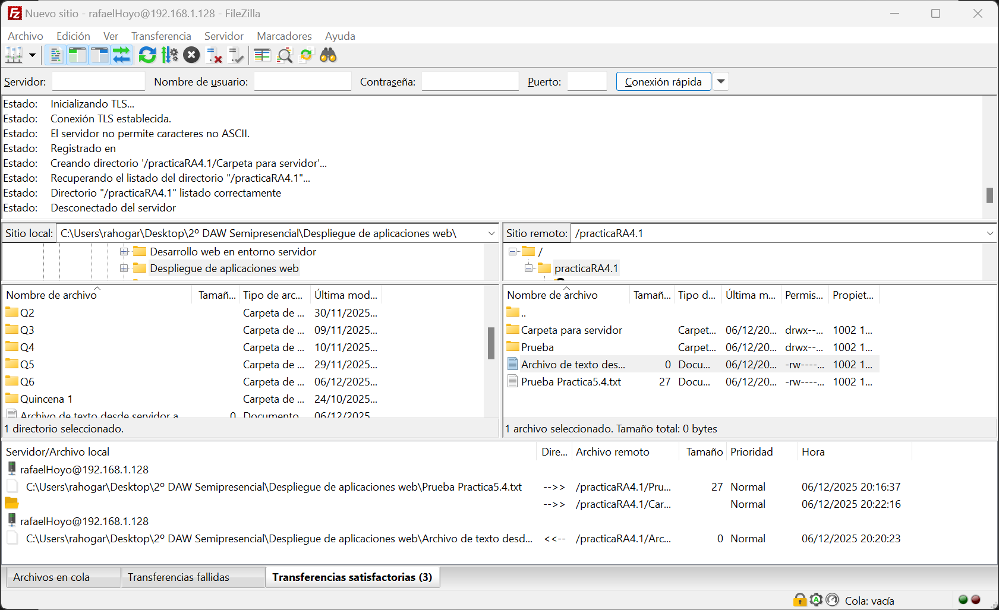


- **Finalizamos el despliegue.** 


